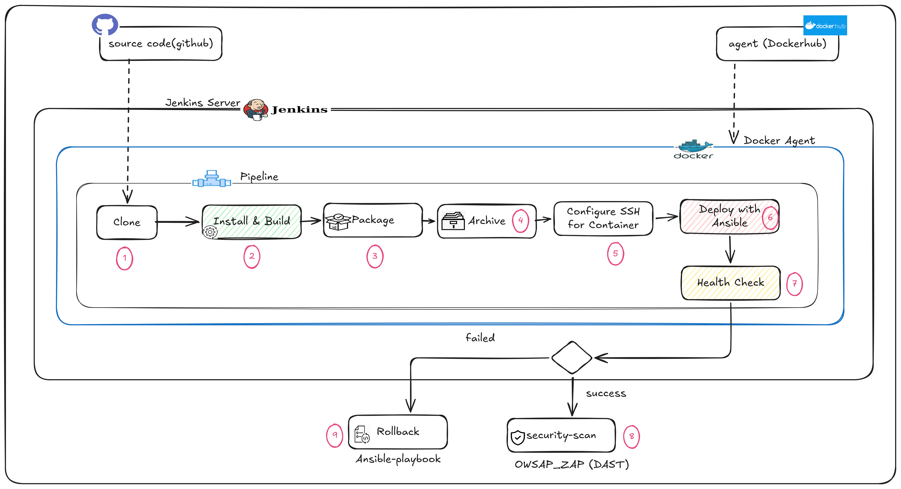

# CI/CD Pipeline Using Jenkins and Ansible for Vue Applications

This project demonstrates a complete CI/CD pipeline for a Vue.js application using Jenkins, Docker, and Ansible.
The pipeline automates the process from cloning source code to building Docker images, deploying to servers,
performing health checks, and running security scans. It also includes optional rollback in case of deployment failures, ensuring safe and reliable releases.

---

## Architecture Diagram



---

## Pipeline Stages:

1. Clone: Retrieve source code from GitHub.
2. Install & Build: Install dependencies and build the project.
3. Package: Prepare application artifacts or Docker image.
4. Archive: Store build artifacts for deployment.
5. Configure SSH for Container: Set up access to deployment servers.
6. Deploy with Ansible: Deploy the built image to the target server(s).
7. Health Check: Verify deployment success.
8. Security Scan (DAST): Run OWASP ZAP to identify vulnerabilities.
9. Rollback: Trigger rollback using Ansible in case of failure.

## Project Tree

```bash
JENKINS-PROJECT/
├── ansible/
│   ├── roles/
│   ├── ansible.cfg
│   ├── deploy.yml
│   ├── inventory.ini
│   ├── jenkins-playbook.yml
│   └── rollback.yml
├── assets/
│   └── architecture_diagram.png
├── src/
│   ├── App.vue
│   ├── Jenkinsfile1
│   ├── main.js
│   ├── .env
│   ├── .gitignore
│   ├── Dockerfile
│   ├── Dockerfile.prod
│   ├── index.html
│   ├── Jenkinsfile
│   ├── package.json
│   ├── README.md
│   ├── security-scan
│   └── vite.config.js
```

## Requirements

- Change Apache root folder point to `/var/www/html/current`
- Install Plugin SSH-Agent on Jenkins UI
- Install Docker on Jenkins node.

## Setup Steps

1. Build and Push Docker Image

```bash
  docker build -t demo-cicd-vue:latest .
  docker tag demo-cicd-vue username/demo-cicd-vue:latest
  docker push username/demo-cicd-vue:latest
```

2. Create a Jenkins access token for pipeline authentication.
3. Install and configure the Jenkins server.
4. Create a pipeline in Jenkins, using Jenkinsfile from SCM.
5. Create a security-scan pipeline for automated DAST testing(Optional).
6. Trigger the pipeline to execute CI/CD steps automatically.

## Recommendations / Enhancements

- Implement automatic rollback on health check failure.
- Enable deployment lock to prevent concurrent deployments.
- Add database migration stage for backend changes.
- Support blue/green deployments with symlink switching.
- Use a shared directory for persistent files:
  - .env
  - Uploads
  - Logs
- Configure release cleanup policy (e.g., keep last 5 releases).
- Move all pipeline variables to Jenkins Environment Variables.
- Optimize pipeline performance.
- Integrate Trivy or other scanners for Docker image security.
